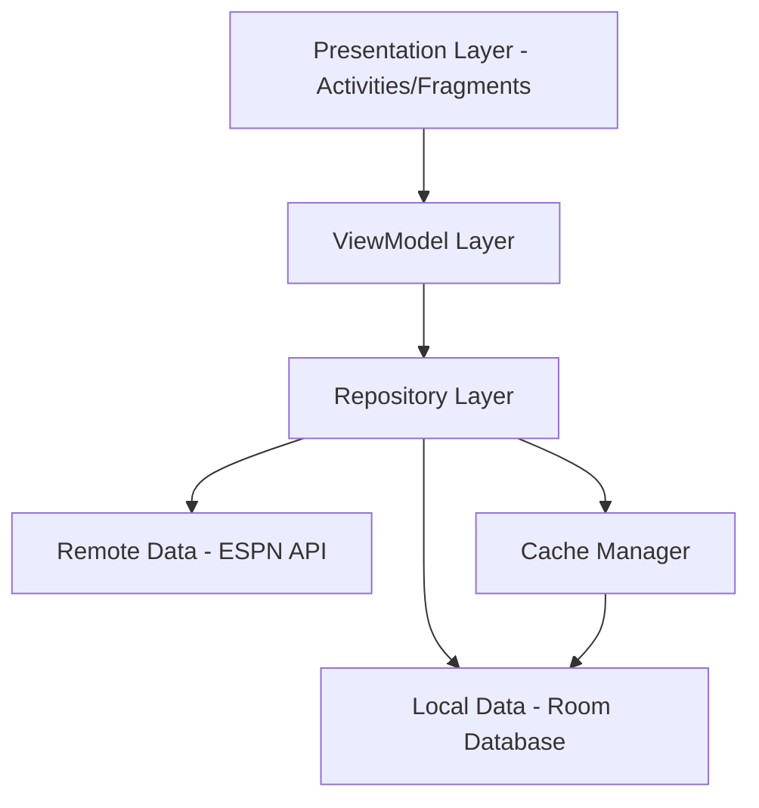

# Fantasy Football Analyzer Design Document

## Overview

The Fantasy Football Analyzer is an Android application that provides comprehensive player analysis by integrating ESPN fantasy football data with NFL statistics and historical matchup performance. The system employs a layered architecture with robust caching, efficient data synchronization, and an intuitive mobile interface optimized for quick decision-making.

The application follows Android architectural best practices using MVVM pattern with Repository pattern for data management, Room database for local persistence, and Retrofit for network operations. The design prioritizes offline functionality, efficient data usage, and responsive user experience.

## Architecture

### High-Level Architecture



### Layer Responsibilities

**Presentation Layer (UI)**
- Activities and Fragments implementing Material Design
- Data binding for reactive UI updates
- Navigation component for screen transitions
- Custom views for statistical charts and graphs

**ViewModel Layer**
- Business logic and UI state management
- LiveData/StateFlow for reactive data streams
- Coroutines for asynchronous operations
- Input validation and error handling

**Repository Layer**
- Single source of truth for data access
- Coordinates between local and remote data sources
- Implements caching strategies and data synchronization
- Handles network connectivity changes

**Data Layer**
- Room database for local persistence
- Retrofit with OkHttp for network operations
- Data Transfer Objects (DTOs) for API responses
- Entity models for database storage

## Components and Interfaces

### Core Components

**PlayerRepository**
```kotlin
interface PlayerRepository {
    suspend fun getPlayer(playerId: String): Result<Player>
    suspend fun getPlayerStats(playerId: String, season: Int): Result<PlayerStats>
    suspend fun getMatchupHistory(playerId: String, opponentTeam: String): Result<List<MatchupData>>
    suspend fun searchPlayers(query: String): Result<List<Player>>
    fun observePlayer(playerId: String): Flow<Player>
}
```

**ESPNApiService**
```kotlin
interface ESPNApiService {
    @GET("fantasy/football/players/{playerId}")
    suspend fun getPlayerData(@Path("playerId") playerId: String): PlayerResponse
    
    @GET("football/nfl/players/{playerId}/stats")
    suspend fun getPlayerStats(@Path("playerId") playerId: String, @Query("season") season: Int): StatsResponse
    
    @GET("football/nfl/teams/{teamId}/schedule")
    suspend fun getTeamSchedule(@Path("teamId") teamId: String): ScheduleResponse
}
```

**CacheManager**
```kotlin
interface CacheManager {
    suspend fun cachePlayerData(player: Player)
    suspend fun getCachedPlayer(playerId: String): Player?
    suspend fun isCacheValid(playerId: String): Boolean
    suspend fun clearExpiredCache()
    suspend fun getCacheSize(): Long
}
```

**MatchupAnalyzer**
```kotlin
interface MatchupAnalyzer {
    suspend fun analyzeMatchup(playerId: String, opponentTeam: String): MatchupAnalysis
    suspend fun generateWeeklyRecommendations(rosterPlayerIds: List<String>): List<PlayerRecommendation>
    suspend fun calculateProjectedPoints(playerId: String, opponentTeam: String): Double
}
```

## Data Models

### Core Entities

**Player Entity**
```kotlin
@Entity(tableName = "players")
data class Player(
    @PrimaryKey val playerId: String,
    val name: String,
    val position: String,
    val team: String,
    val injuryStatus: String?,
    val isActive: Boolean,
    val lastUpdated: Long
)
```

**PlayerStats Entity**
```kotlin
@Entity(tableName = "player_stats")
data class PlayerStats(
    @PrimaryKey val id: String,
    val playerId: String,
    val season: Int,
    val week: Int?,
    val fantasyPoints: Double,
    val rushingYards: Int,
    val passingYards: Int,
    val receivingYards: Int,
    val touchdowns: Int,
    val gameDate: Long
)
```

**MatchupData Entity**
```kotlin
@Entity(tableName = "matchup_data")
data class MatchupData(
    @PrimaryKey val id: String,
    val playerId: String,
    val opponentTeam: String,
    val gameDate: Long,
    val fantasyPoints: Double,
    val performanceRating: Double,
    val season: Int,
    val week: Int
)
```

**Analysis Models**
```kotlin
data class MatchupAnalysis(
    val playerId: String,
    val opponentTeam: String,
    val averageFantasyPoints: Double,
    val historicalGames: List<MatchupData>,
    val projectedPoints: Double,
    val confidenceLevel: Double,
    val comparisonToSeasonAverage: Double
)

data class PlayerRecommendation(
    val player: Player,
    val projectedPoints: Double,
    val matchupRating: String,
    val confidenceLevel: Double,
    val reasoning: String
)
```

Now I need to complete the prework analysis before writing the Correctness Properties section.

<function_calls>
<invoke name="prework">
<parameter name="featureName">fantasy-football-analyzer

## Correctness Properties

*A property is a characteristic or behavior that should hold true across all valid executions of a system-essentially, a formal statement about what the system should do. Properties serve as the bridge between human-readable specifications and machine-verifiable correctness guarantees.*

### Property Reflection

After analyzing all acceptance criteria, several properties can be consolidated to eliminate redundancy:

- Properties 1.1, 1.2, and 1.3 all test player data display completeness and can be combined into a comprehensive "Player data completeness" property
- Properties 3.1 and 3.2 both test caching functionality and can be combined into a "Cache round-trip" property  
- Properties 6.1, 6.2, and 6.3 all test API efficiency and can be combined into a "API request optimization" property
- Properties 4.2 and 4.3 both test recommendation generation and can be combined into a "Recommendation accuracy" property

### Core Properties

**Property 1: Player data completeness**
*For any* valid NFL player, when retrieved and displayed, the system should include all required fields: current season statistics (fantasy points, rushing yards, passing yards, receiving yards, touchdowns), player information (position, team, injury status), and proper visual representation with charts/graphs
**Validates: Requirements 1.1, 1.2, 1.3, 5.1**

**Property 2: Historical matchup data span**
*For any* valid player-opponent combination, when matchup analysis is requested, the system should retrieve exactly 3 seasons of historical data and calculate accurate averages and comparisons to season performance
**Validates: Requirements 2.1, 2.2, 2.5**

**Property 3: Matchup analysis completeness**
*For any* historical matchup data, when displayed, the system should show game-by-game performance breakdown and all required analysis components
**Validates: Requirements 2.3**

**Property 4: Cache round-trip consistency**
*For any* player data retrieved from ESPN API, the system should store it in cache and be able to retrieve identical data when offline, with proper freshness indicators for data older than 24 hours
**Validates: Requirements 3.1, 3.2, 3.3**

**Property 5: Cache synchronization**
*For any* cached data, when connectivity returns, the system should automatically update with current information while maintaining data consistency
**Validates: Requirements 3.4**

**Property 6: Cache storage management**
*For any* cache state, when storage exceeds 100MB, the system should remove oldest entries first while maintaining cache functionality
**Validates: Requirements 3.5**

**Property 7: Recommendation completeness**
*For any* roster of players, when weekly recommendations are requested, the system should analyze all players, rank them based on historical matchup performance, show projected points, and properly handle tie-breaking with consistency metrics
**Validates: Requirements 4.1, 4.2, 4.3, 4.4**

**Property 8: Injury impact on recommendations**
*For any* player with injury status, when generating recommendations, the system should adjust rankings and projections appropriately based on availability
**Validates: Requirements 4.5**

**Property 9: Large dataset pagination**
*For any* dataset exceeding screen capacity, the system should implement pagination or scrolling to maintain interface responsiveness
**Validates: Requirements 5.3**

**Property 10: API request optimization**
*For any* sequence of data requests, the system should implement throttling to prevent excessive calls, serve cached data for duplicates, and use incremental updates rather than complete refreshes
**Validates: Requirements 6.1, 6.2, 6.3**

**Property 11: Rate limit handling**
*For any* API rate limit scenario, the system should queue requests and retry with exponential backoff while maintaining functionality
**Validates: Requirements 6.5**

## Error Handling

### Network Error Handling
- **Connection Timeouts**: Implement exponential backoff with maximum retry limits
- **API Rate Limiting**: Queue requests with intelligent retry scheduling
- **Invalid Responses**: Graceful degradation with cached data fallback
- **Network Unavailability**: Seamless offline mode with cached data

### Data Error Handling
- **Missing Player Data**: Display appropriate messages and available alternatives
- **Corrupted Cache**: Automatic cache invalidation and re-fetch mechanisms
- **Invalid API Responses**: Data validation with error logging
- **Insufficient Historical Data**: Fallback to league averages and position rankings

### User Input Error Handling
- **Invalid Player Search**: Fuzzy matching with suggestions
- **Empty Search Results**: Alternative search suggestions
- **Malformed Queries**: Input sanitization and validation
- **Concurrent Operations**: Request deduplication and state management

## Testing Strategy

### Dual Testing Approach

The application will employ both unit testing and property-based testing to ensure comprehensive coverage:

**Unit Testing**
- Specific examples demonstrating correct behavior
- Integration points between components (Repository-API, Cache-Database)
- Error conditions and edge cases
- UI component behavior and navigation

**Property-Based Testing**
- Universal properties that should hold across all inputs
- Data consistency and correctness across random inputs
- Cache behavior with various data states
- API integration with different response scenarios

### Property-Based Testing Implementation

**Framework**: We will use **Kotest Property Testing** for Kotlin, which provides excellent integration with Android testing frameworks and supports complex data generation.

**Configuration**: Each property-based test will run a minimum of 100 iterations to ensure thorough coverage of the input space.

**Test Tagging**: Each property-based test will include a comment explicitly referencing the correctness property using this format: `**Feature: fantasy-football-analyzer, Property {number}: {property_text}**`

**Generator Strategy**: 
- Smart generators that constrain to valid input spaces (valid player IDs, team names, realistic statistics)
- Composite generators for complex scenarios (player-matchup combinations, roster configurations)
- Edge case generators for boundary conditions (empty caches, network failures, rate limits)

### Testing Requirements

- Each correctness property must be implemented by a single property-based test
- Unit tests complement property tests by covering specific integration scenarios
- Tests must validate real functionality without mocks for core business logic
- Property tests should focus on data consistency, business rule compliance, and system invariants
- Unit tests should focus on component integration, error handling, and specific user scenarios